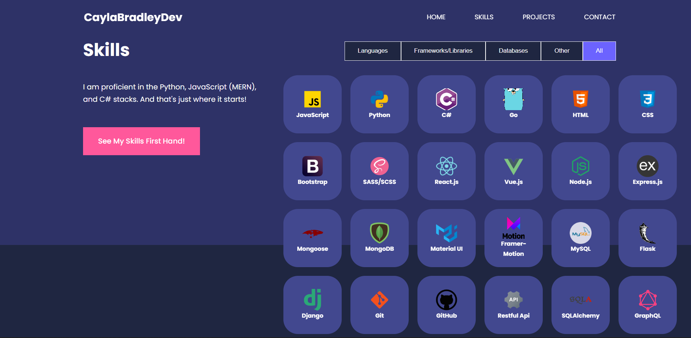

# Personal Portfolio

### about
A ***Personal Portfolio*** designed to showcase my evergrowing skills and projects.

This project utilizes `JavaScript`, `React`, and the `React Icons Library` to create an easily managed and composible design. Design aspects are implemented through `SCSS`, with animations conducted with the `Framer-Motion` library. 

Visitors have the opportunity to contact the developer directly through the `Formspree API`.

-----------

-----------

-----------

-----------

**Features for version 1.0:**
 - [x] Responsive Layout
	 - [x] Large+ Screens
	 - [x] Medium Screens
	 - [x] Small Screens
 - [x] Fully Functional Contact Form
	 - [x] Send emails from client
	 - [ ] Form Validation

**Features for version 2.0:**
 - [x] React.js Frontend

**Features for 3.0**
 - [ ] MongoDB database
 - [ ] Node.js backend